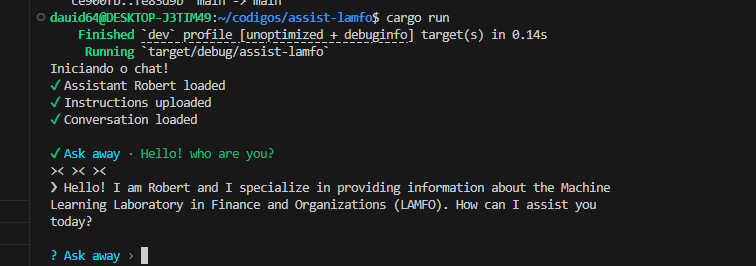

# Robert AI LAMFO
Robert AI is a expert about LAMFO (LAMFO - Machine Learning Laboratory in Finance and Organizations) laboratory in which i participate. This is one project ambitious for using assistants personalizates to solve tasks or transmited specific informations about rules of one organization for example.

My idea is expand knowledge of Robert for get informations through web scrapping, videos and database. For help organizations other areas for example Law, Economy, News and many others depending on your imagination.

## Run Aplication
Have installed cargo in you system.

Copy rename config_example.toml localized in path /.cargo for config.toml
and add your open ai api key.

Open prompt in source code run this code `cargo run`

